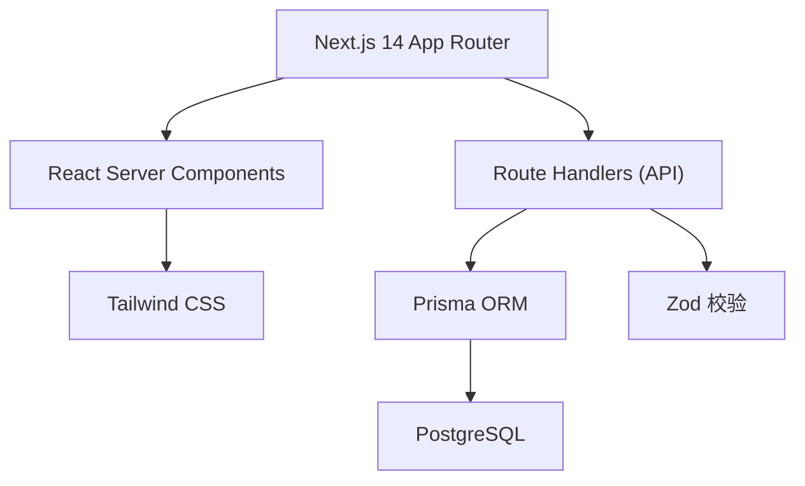
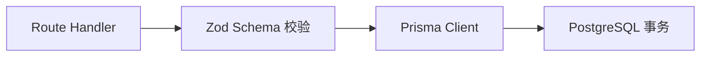
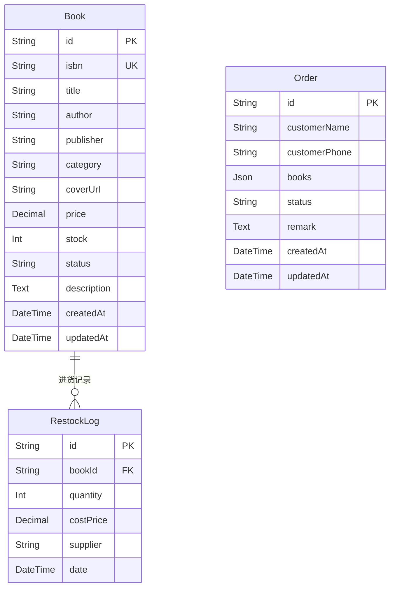

## 1. 架构设计



## 2. 技术描述
- 前端框架：Next.js 14（App Router）+ React 18 + TypeScript
- UI 样式：Tailwind CSS 3
- 数据库：PostgreSQL（Vercel Postgres 或本地 Docker）
- ORM：Prisma
- 参数校验：Zod
- 数据库驱动：@prisma/client + @vercel/postgres
- 部署：Vercel 全栈部署

## 3. 路由定义
| Route | 用途 |
|-------|------|
| / | 店面前台首页 |
| /admin | 店主后台（密码保护） |
| /api/books | 书目 CRUD + 搜索 |
| /api/orders | 订单 CRUD + 状态流转 |
| /api/restock | 进货记录录入 |

## 4. API 定义

```typescript
// Book
interface Book {
  id: string;
  isbn: string;
  title: string;
  author: string;
  publisher: string;
  category: string;
  coverUrl: string;
  price: number;
  stock: number;
  status: '在售' | '暂无库存' | '下架';
  description?: string;
  createdAt: Date;
  updatedAt: Date;
}

// Order
interface Order {
  id: string;
  customerName: string;
  customerPhone: string;
  books: { bookId: string; quantity: number }[];
  status: '待确认' | '已确认' | '已取书' | '已取消';
  remark?: string;
  createdAt: Date;
}

// RestockLog
interface RestockLog {
  id: string;
  bookId: string;
  quantity: number;
  costPrice: number;
  supplier: string;
  date: Date;
}
```

## 5. 服务端架构



## 6. 数据模型



## 7. 环境变量
```
DATABASE_URL=postgres://...
ADMIN_PASSWORD=xxx
SMS_API_KEY=xxx（可选）
```
