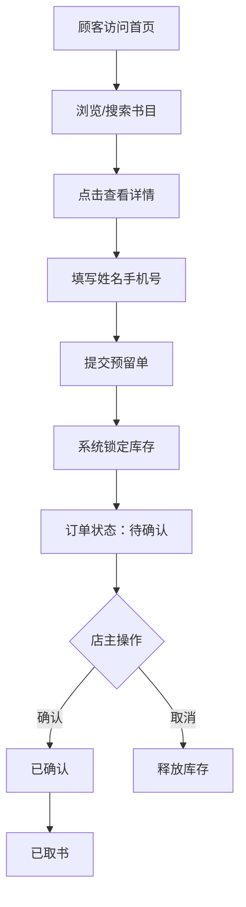

## 1. 产品概述
独立书店库存与在线预留系统，帮助实体书店将书库搬上网，实现老顾客在线查书、下单预留，店主随时查看库存、记录进货和销售，取代纸质台账。
- 目标用户：独立书店店主及老顾客
- 核心价值：简化库存管理流程、提供在线预留服务、数据化运营决策

## 2. 核心功能

### 2.1 用户角色
| 角色 | 使用方式 | 核心权限 |
|------|----------|----------|
| 顾客 | 无需注册，直接访问 | 浏览书目、搜索筛选、提交预留单 |
| 店主 | 通过密码访问 /admin | 书目管理、订单管理、进货录入、销售统计 |

### 2.2 功能模块
1. **店面前台**：书目卡片网格、分类筛选、关键词搜索、图书详情、在线预留
2. **店主后台**：书目管理、订单查询、进货记录、销售统计

### 2.3 页面详情
| 页面名称 | 模块名称 | 功能描述 |
|-----------|-------------|---------------------|
| 店面前台 | 书目卡片网格 | 展示封面图、书名、作者、价格、库存状态标签 |
| 店面前台 | 分类标签切换 | 按分类快速筛选书目 |
| 店面前台 | 关键词搜索 | 防抖300ms模糊搜索书名/作者 |
| 店面前台 | 详情侧滑Panel | 右侧滑入展示详情和预留按钮 |
| 店面前台 | 预留表单 | 填写姓名和手机号提交预留单 |
| 店主后台 | 书目管理表 | 新增/编辑书目、批量CSV导入、库存预警橙色标记 |
| 店主后台 | 订单查询 | 按手机号/状态筛选、状态流转操作 |
| 店主后台 | 进货录入 | 录入进货记录，库存自动累加 |
| 店主后台 | 销售统计 | 本月销售额、分类销量占比、滞销书列表 |

## 3. 核心流程
顾客浏览书目 → 搜索/筛选 → 查看详情 → 填写姓名和手机号提交预留 → 店主确认订单 → 顾客取书

## 4. 用户界面设计

### 4.1 设计风格
- 店面前台：暖米色背景 #faf7f2，木纹质感卡片，价格红色 #dc2626
- 库存状态：库存充足绿色标签，暂缺橙色标签
- 店主后台：简洁白底，Tailwind Table 组件，订单状态色块区分
- 动画：侧滑详情Panel从右侧滑入 translate-x 过渡200ms
- 字体：标题使用衬线字体营造书香氛围，正文使用易读无衬线字体

### 4.2 页面设计概述
| 页面名称 | 模块名称 | UI元素 |
|-----------|-------------|-------------|
| 店面前台 | 顶部栏 | Logo、搜索框、分类标签、后台入口 |
| 店面前台 | 书卡网格 | 响应式网格、封面图、书名、作者、价格、库存标签 |
| 店面前台 | 详情Panel | 右侧遮罩层、大图、详情信息、预留表单 |
| 店主后台 | 侧边导航 | 书目/订单/进货/统计四个入口 |
| 店主后台 | 数据表格 | 斑马纹行、操作按钮、状态色块 |

### 4.3 响应式
- Desktop-first 设计，移动端自适应
- 书卡网格桌面 4 列，平板 3 列，手机 1-2 列
- 详情Panel全屏覆盖移动端
